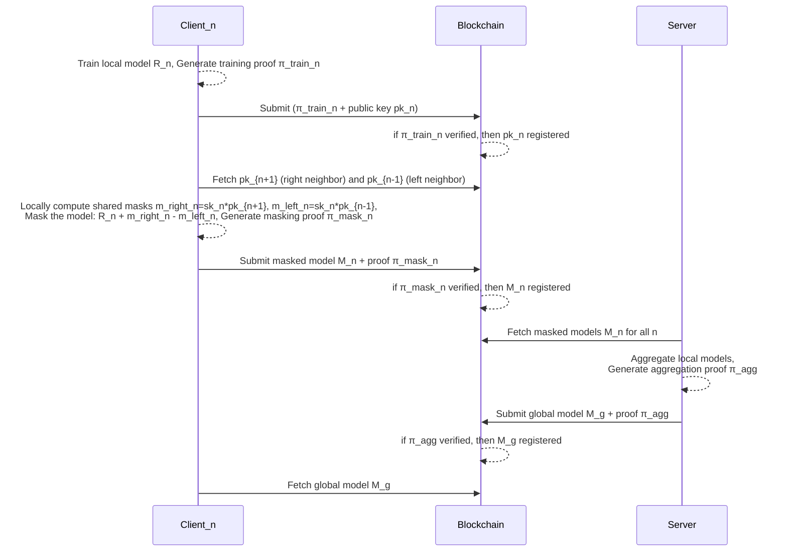

---
title: Publicly Verifiable, Private & Collaborative AI Training
date: 2025-04-30
description: An exploration of verifiable, privacy-preserving & collaborative AI model training in a decentralized network
---
In this post, I will leave some notes about [Verifiable Federated Learning CLI Demo](https://github.com/yuriko627/vfl-demo) I have prototyped. 

In a nutshell, this system allows **mutually distrusted parties** (let's say nodes in a decentralized network like Ethereum) **to privately contribute their data and collaboratively train an AI model with public verifiability**.

In a separate post, I will share more about my vision for this technology with some fitting use cases in my mind. 

## Table of Contents
1. [Architecture Overview](#architecture-overview)  
   1.0 [Protocol steps](#protocol-steps)  
   1.1 [Local training in clients](#local-training-in-clients)  
   1.2 [Masking models in clients](#masking-models-in-clients)  
   1.3 [Aggregation in server](#aggregation-in-server)  
   1.4 [Notes on fixed-point arithmetic](#notes-on-fixed-point-arithmetic)

2. [Future Research Direction](#future-research-direction)  
   2.1 [Training dataset validation](#training-dataset-validation)  
   2.2 [ZK circuit for more complex training algorithm... or fine-tuning?](#zk-circuit-for-more-complex-training-algorithm-or-fine-tuning)  
   2.3 [Storing local model updates offchain](#storing-local-model-updates-offchain)  
   2.4 [Batched/Packed secret sharing for masking models](#batchedpacked-secret-sharing-for-masking-models)  
   2.5 [Clients dropouts tolerance + real-time join](#clients-dropouts-tolerance--real-time-join)  
   2.6 [Reward system](#reward-system)


## Architecture Overview
In my CLI demo, there are 4 parties simulated:
- 3 distributed clients that locally train a model on their own raw data
- 1 server that aggregates the local models submitted by clients

And I did not assume a P2P connection between them, so they communicate via blockchain.

### Protocol steps
1. Clients locally train a model on their data using some agreed training algorithm. While training, they generate a proof $\pi_{train}$ for the correct execution of the training algorithm on their secret inputs. 
2. Clients generate their own public and private key pair $(sk_n, pk_n)$. They submit $pk_n$ along with the proof $\pi_{train}$ to blockhain and after the proof verifies, their public keys are registered on chain, which signals their participation to this collaborative training system.
3. Clients generate a pair-wise shared mask $m_{right}$ and $m_{left}$ with their neighboring clients `neighbor_right` and `neighbor_left`. Clients use their own private key $sk_n$ and the neighbor's public keys $pk_{n+1}$ and $pk_{n-1}$, respectively (I'm explaining the algorithm in more detail in section 2. *Masking models in clients*). After masking their model parameters (weights and bias - I'll just call them a "model" from now on), they publish the masked model $M_n$ on chain, along with zkp $\pi_{mask}$ which proves that they executed training and masking process correctly. 
4. After the masking proof $\pi_{mask}$ verifies, server fetches the masked models to aggregate them. During the aggregation, server generates a proof $\pi_{agg}$ for the correct execution of aggregation, and after the proof $\pi_{agg}$ verifies, server registers the aggregated global model $M_g$ on chain.
5. Clients can fetch the global model $M_g$ from blockchain. 



### 1. Local training in clients 
There are client1-3, and each client locally trains a model using their raw data (for example client1 has input data that looks like [this]( https://github.com/yuriko627/vfl-demo/blob/main/clients/client1/training/Prover.toml)) inside ZK with logistic regression algorithm. [The Noir circuit for logistic regression](https://github.com/hashcloak/noir-mpc-ml/blob/master/src/ml.nr) was implemented by Hashcloak for their `noir-mpc-ml` project (their project report is [here](https://github.com/hashcloak/noir-mpc-ml-report)), and I've imported this circuit for the local training. Their approach, co-snark can be taken as an alternative to achieve the same goal as mine, but since my approach offloads the training process to clients and it does not require running it inside MPC, mine is more efficient. (It just runs the training algorithm inside ZK, in order to give a public verifiability.) 

<figure style="text-align: center; margin: 2rem;">

  

  <figcaption style="font-style: italic; margin-top: 0.5rem;">Architecture for HashCloak's CoSNARK-ML</figcaption>

</figure>


<figure style="text-align: center; margin: 2rem;">

  

  <figcaption style="font-style: italic; margin-top: 0.5rem;">Architecture for my construction: offloading training to the client side</figcaption>

</figure>

For example, Hashcloak has obtained the results below (with 3 MPC nodes):


(reference: [Benchmarks](https://github.com/hashcloak/noir-mpc-ml))

Whereas my system has obtained (with 3 clients and 1 server all simulated wih Apple M1 16GB):


| Epochs | Train samples | Training time [sec] | 
|--------|---------------|---------------------|
| 10     | 30            | 31                  |
| 10     | 50            | 44                  |
| 20     | 30            | 55                  |
| 20     | 50            | 96                  |


### 2. Masking models in clients
This is a cryptographically interesting part. 
After training a model, clients submit the model so that a server can aggregate them to build a global model. However, they cannot just publish a raw model, since there is a multitude of attacks you can make to reconstruct the training data, just by looking at the weights (keywords: "Gradient Inversion Attack", "Membership Inference Attack", "Property Inference Attack"). 

So how can you mask your model, in such a way that the server can calculate a **aggregation of raw models** without knowing each individual values?


### One-time pad based on Diffie-Hellman Key Exchange 
I employed a technique from [the original federated learning paper](https://eprint.iacr.org/2017/281.pdf), which explains how clients send a masked model to a server and a server aggregates them to obtain a global model removing the masks at the end. 

In summary, clients generate pair-wise mask, add/subtract it from their raw model so that they cancel with each other when the server aggregates them.

Let's say we set clients in a ring topology as below and lable the pair-wise noise/mask between paired clients as $m_{start-node, end-node}$. (labeling nodes counterclockwise in this case)


- Between `client1` and `client2`, they generate a shared mask $m_{1,2}$
- Between `client2` and `client3`, they generate a shared mask $m_{2,3}$
- Between `client3` and `client1`, they generate a shared mask $m_{3,1}$

Imagine, each client **add** a mask they generated with their **right** neighbor client, and **subtract** a mask they generated with the **left** neighbor client. 


For each client $n$, masked model $Mn$ is calculated by raw model $Rn$ + mask with the right neighbor $m_{right}$ - mask with the left neighbor $m_{left}$.

For example, 
- client1: masked model $M_1$ = raw model $R_1$ + $m_{1,2}$ - $m_{3,1}$
- client2: masked model $M_2$ = raw model $R_2$ + $m_{2,3}$ - $m_{1,2}$
- client3: masked model $M_3$ = raw model $R_3$ + $m_{3,1}$ - $m_{2,3}$

Then, when a server sums up the masked models $M_n$,

$M_1$ + $M_2$ + $M_3$ = $R_1$ + $m_{1,2}$ - $m_{3,1}$ + $R_2$ + $m_{2,3}$ - $m_{1,2}$ + $R_3$ + $m_{3,1}$ - $m_{2,3}$ = $R_1$ + $R_2$ + $R_3$

You can see how shared masks between each client will cancel out, and that way server can calculate the **sum of raw models $R_n$ without knowing its individual values**. 

About the privacy on raw models $R_n$, each client can only calculate the masks with their own neighbors.
For example:
- client1 does not know $m_{2,3}$ => cannot reconstruct neither $R_2$ or $R_3$
- client2 does not know $m_{3,1}$ => cannot reconstruct neither $R_1$ or $R_3$
- client3 does not know $m_{1,2}$ => cannot reconstruct neither $R_1$ or $R_2$

How can this be done more concretely?
A pair of clients can generate a shared mask using (Elliptic-curve) Diffie-Hellman Key Exchange protocol as follows: 
1. Each client generates their own public-private key pair. 
2. Clients publish their public key. 
3. Each client locally computes the shared mask by multiplying their private key and their neighbors public key. 


For the shared key generation, I used this [ECDH Library](https://github.com/privacy-scaling-explorations/zk-kit.noir/tree/main/packages/ecdh) inside zk-kit.noir library set developed by PSE. 

You can check the whole masking prover [here](https://github.com/yuriko627/vfl-demo/blob/main/provers/masking_prover/src/mask.nr). 

### 3. Aggregation in server
Aggregation process was fairly simple. The server first has to fetch the published masked models from blockchain, and sum them up element wise. 

```
// Sum up weights and bias at the same index for each class, submitted by clients 1-3
//                          |class1                     | |class2                     | |class3                     |
// Model 1 (from client 1): [w111, w112, w113, w114, b11] [w121, w122, w123, w124, b12] [w131, w132, w133, w134, b13]
// Model 2 (from client 2): [w211, w212, w213, w214, b21] [w221, w222, w223, w224, b22] [w231, w232, w233, w234, b23]
// Model 3 (from client 3): [w311, w312, w313, w314, b31] [w321, w322, w323, w324, b32] [w331, w332, w333, w334, b33]
// Aggregated global model: [w111+w211+w311, w112+w212+w312,...,b11+b21+b31]...
```
One thing to mention is, since I wanted to perform weighted average for the model aggregation, clients actually submit `weights * number of samples` and `bias * number of samples` along with the `number of samples` they used for their training. (They append `number of samples` in an array of local models submitted to blockchain)

The server divides the sum for `weights` and `bias` by the total number of samples at the end. 
You can check the aggregation prover [here](https://github.com/yuriko627/vfl-demo/blob/main/provers/aggregation_prover/src/aggregate.nr).

### Notes on fixed-point arithmetic
When writing masking and aggregation provers, I had to be careful about the **fixed-point arithmetic range checks**. In machine learning, you almost always get decimal numbers in your operation. However, since you cannot directly express decimal numbers inside zk circuit, there is this technique of using [fixed-point arithmetic](https://github.com/hashcloak/noir-mpc-ml-report/blob/main/src/fixed-point-arithmetic.md): you scale small decimal numbers by some fixed factor and use the first half field elements (<= ~126bits) as positive numbers, and the second half (>= ~126bits) to represent negative numbers. Following this encoding rule, you need to add a bit-size check for the operands such as `assert_bitsize::<n>` before performing each arithmetic operation in order to not overflow from the field. (With haskcloak's [`noir-mpc-ml` library](https://github.com/hashcloak/noir-mpc-ml/tree/master), you can call these assertions in a more customizable way. Underlying [`Quantized` struct](https://github.com/hashcloak/noir-mpc-ml/blob/master/src/quantized.nr) will not automatically assert them before arithmetic operations. That way, you can reduce the number of constraints and make the zk circuit more performant.

For more concreteness, I added detailed comments before each `assert_bitsize` in my code, so if you're curious about how to do safe addition and multiplication in fixed-point arithmetic, you can go check them in my [masking prover](https://github.com/yuriko627/vfl-demo/blob/main/provers/masking_prover/src/mask.nr) and [aggregation prover](https://github.com/yuriko627/vfl-demo/blob/main/provers/aggregation_prover/src/aggregate.nr). 


## Future Research Direction
There are quite a few things I want to research more and add to the system.

### 1. Training dataset validation
Based on the assumption of not trusting the clients (that's why we ask them to prove the correct execution of local training and masking!), we should probably check that they used valid input data as well. 
Many ways of so-called "data poisoning" attacks are known in federated learning. Namely, clients can maliciously use invalid (or carefully crafted) training inputs such that they can manipulate the global model performance.
In order to prevent such attacks, how can we perform some input validation while keeping their inputs private?
I just started researching it, but it generally seems that you can check a local model update to follow some distribution and see whether the client manipulated their training inputs. 


This [talk](https://www.youtube.com/watch?v=mdMpQMe5_KQ) (which I got the above picture from) explains an interesting research on how to combat backdoor attacks - a type of data poisoning attacks, without entirely eliminating the manipulated model updates from the malicious clients (so that they can keep the global model accuracy fairly high). If we were to employ such validation, it has to be done on the client-side inside ZK before masking the model.

### 2. ZK circuit for more complex training algorithm... or fine-tuning?
Currently, clients locally execute a fairly simple training algorithm, logistic regression inside ZK. But can we use more complex algorithms such as neural networks? I'm looking into [Zator project](https://github.com/lyronctk/zator) to see if there is anything reusable for training. Also, maybe instead of executing the whole training on the client side, we can broadcast pre-trained model onchain, and let client perform just fine-tuning on top of it. Doing so, how much can we reduce the computational cost on the client side? (Note that this task is more of my intellectual curiosity. Actually for verifiable federated learning use case ideas in my mind, I believe using models with more interpretability such as logistic regression makes more sense)

### 3. Storing local model updates offchain
Each client currently submits a local model — an array of 4 weights and 1 bias for 3 classes (e.g. `Model 1 (from client 1): [w111, w112, w113, w114, b11] [w121, w122, w123, w124, b12] [w131, w132, w133, w134, b13]` as I've shown in section 3. *Aggregation in server*) to blockchain directly. This works because the models are extremely small, but what if the parameter size grows? 
Then I can easily switch to a design where clients only publish hash of the local models on-chain, while uploading the full local model to a decentralized storage such as IPFS. When the server retrieves local models from IPFS, they recompute the hash of the fetched file and verify it matches the hash stored on-chain. 

### 4. Batched/Packed secret sharing for masking models
This is a complete change in the cryptographic technique to mask the models. 

#### For better security 
Imagine you're a $client_n$ which publishes a masked model $M_n$. **If an attacker colludes with your two neighbors** $client_{n-1}$ and $client_{n+1}$ (receiving their secret key $sk_{n-1}$, $sk_{n+1}$ respectively), **an attacker can reconstruct your raw model** $R_n$ (= $M_n$ - $mask_{n, n+1}$ + $mask_{n-1, n}$).
This is way worse than t-out-of-n threshold security model of MPC. 

#### For better efficiency
In addition, current one-time pad technique requires us to [generate a mask for each model parameter](https://github.com/yuriko627/vfl-demo/blob/main/provers/masking_prover/src/mask.nr#L24), meaning that the **required number of the masks grows linearly with the size of the model parameters**. Also, because we employ fixed-point arithmetic, each mask is constrained to be less than ~124bits, but if we employ a different encoding technique of decimal numbers inside ZK, **mask bitsize should also grows linearly with the each parameter bitsize for good security**.

I'm now looking into a technique called [*batched/packed secret sharing*](https://eprint.iacr.org/2023/099.pdf#page=23), which allows us to encode multiple secrets (e.g. weights and biases in our case) into a single polynomial. A distrusted party (e.g. a server) can then receive the shares and compute the elementwise sum across different secrets without learning their individual values.

I'm not entirely sure about the computational efficiency or interaction overhead when it comes to multiplication (which the server needs to perform for weighted averaging, but we could potentially offload that to the clients after they fetch the global model), but this MPC-based approach might make more sense if we prioritize security and asymptotic efficiency. 

Alternatively, we can create fully connected graph topology so that $n-1$ clients need to collude to reveal the raw models. Though this approach comes with a cost of $O(nm)$ shared mask generations ($n$ = #clients, $m$ = #model size) . 

### 5. Clients dropouts tolerance + real-time join 

Right now this system does not tolerate any client dropouts after they sign up for the system. If the server cannot obtain all the local models to aggregate, the masks added/subtracted at each remained client won't cancel out for the partial aggregation, so it will just be a gibberish value. I'm looking into this [paper](https://arxiv.org/pdf/2205.06117) which seems to solve this problem by bringing (shared-secret based) MPC in before the masking. Their protocol says each client has to communicate with $O(log(n))$ number of other clients (where $n$ is the total number of clients), in order for the server to obtain the correct aggregated model values, even after some clients drop out in the middle of the protocol. Also, is there any way to allow new client to join the training without requiring the previous nodes to redo the masking? 

### 6. Reward system 
This is probably the coolest extension that this system can have. Clients can get compensated for contributing their own data to train a model, while there is privacy protection on their data. But what should be the *right* metrics to calculate your contribution? There are several mathematical functions to measure how much a data point influenced the output model parameters during the training, such as [this classic influence function](https://arxiv.org/pdf/1703.04730). Or maybe, the key question to a fair attribution is "who taught AI about it earlier than anyone else?" rather than how much you influenced AI's learning over time. So the reward should be given based on the time ranking of data provision. This topic involves more philosophical thinking, or the discussion should be done with concrete use cases, so I will write more about the design of the reward system in a separate post. 

-----

Special thanks to [Sora](https://x.com/SoraSue77), [Ying Tong](https://x.com/therealyingtong), [Pierre](https://x.com/xyz_pierre), [Timofey](https://x.com/timofeyfey) for giving me suggestion/ideas for the future research direction, and other friends (especially those that I spent time with at [Community Privacy Residency](https://community-privacy.github.io/) this spring!) for discussion. 

If you have any feedback or comments on this post and are willing to engage in a meaningful discussion, please leave them in the HackMD draft: https://hackmd.io/@yuriko/BJ1ptkh0yx 


---
title: Publicly Verifiable, Private & Collaborative AI Training
date: 2025-04-30
description: An exploration of verifiable, privacy-preserving & collaborative AI model training in a decentralized network
---
In this post, I will leave some notes about [Verifiable Federated Learning CLI Demo](https://github.com/yuriko627/vfl-demo) I have prototyped. 

In a nutshell, this system allows **mutually distrusted parties** (let's say nodes in a decentralized network like Ethereum) **to privately contribute their data and collaboratively train an AI model with public verifiability**.

In a separate post, I will share more about my vision for this technology with some fitting use cases in my mind. 

## Table of Contents
1. [Architecture Overview](#architecture-overview)  
   1.0 [Protocol steps](#protocol-steps)  
   1.1 [Local training in clients](#local-training-in-clients)  
   1.2 [Masking models in clients](#masking-models-in-clients)  
   1.3 [Aggregation in server](#aggregation-in-server)  
   1.4 [Notes on fixed-point arithmetic](#notes-on-fixed-point-arithmetic)

2. [Future Research Direction](#future-research-direction)  
   2.1 [Training dataset validation](#training-dataset-validation)  
   2.2 [ZK circuit for more complex training algorithm... or fine-tuning?](#zk-circuit-for-more-complex-training-algorithm-or-fine-tuning)  
   2.3 [Storing local model updates offchain](#storing-local-model-updates-offchain)  
   2.4 [Batched/Packed secret sharing for masking models](#batchedpacked-secret-sharing-for-masking-models)  
   2.5 [Clients dropouts tolerance + real-time join](#clients-dropouts-tolerance--real-time-join)  
   2.6 [Reward system](#reward-system)


## Architecture Overview
In my CLI demo, there are 4 parties simulated:
- 3 distributed clients that locally train a model on their own raw data
- 1 server that aggregates the local models submitted by clients

And I did not assume a P2P connection between them, so they communicate via blockchain.

### Protocol steps
1. Clients locally train a model on their data using some agreed training algorithm. While training, they generate a proof $\pi_{train}$ for the correct execution of the training algorithm on their secret inputs. 
2. Clients generate their own public and private key pair $(sk_n, pk_n)$. They submit $pk_n$ along with the proof $\pi_{train}$ to blockhain and after the proof verifies, their public keys are registered on chain, which signals their participation to this collaborative training system.
3. Clients generate a pair-wise shared mask $m_{right}$ and $m_{left}$ with their neighboring clients `neighbor_right` and `neighbor_left`. Clients use their own private key $sk_n$ and the neighbor's public keys $pk_{n+1}$ and $pk_{n-1}$, respectively (I'm explaining the algorithm in more detail in section 2. *Masking models in clients*). After masking their model parameters (weights and bias - I'll just call them a "model" from now on), they publish the masked model $M_n$ on chain, along with zkp $\pi_{mask}$ which proves that they executed training and masking process correctly. 
4. After the masking proof $\pi_{mask}$ verifies, server fetches the masked models to aggregate them. During the aggregation, server generates a proof $\pi_{agg}$ for the correct execution of aggregation, and after the proof $\pi_{agg}$ verifies, server registers the aggregated global model $M_g$ on chain.
5. Clients can fetch the global model $M_g$ from blockchain. 


### 1. Local training in clients 
There are client1-3, and each client locally trains a model using their raw data (for example client1 has input data that looks like [this]( https://github.com/yuriko627/vfl-demo/blob/main/clients/client1/training/Prover.toml)) inside ZK with logistic regression algorithm. [The Noir circuit for logistic regression](https://github.com/hashcloak/noir-mpc-ml/blob/master/src/ml.nr) was implemented by Hashcloak for their `noir-mpc-ml` project (their project report is [here](https://github.com/hashcloak/noir-mpc-ml-report)), and I've imported this circuit for the local training. Their approach, co-snark can be taken as an alternative to achieve the same goal as mine, but since my approach offloads the training process to clients and it does not require running it inside MPC, mine is more efficient. (It just runs the training algorithm inside ZK, in order to give a public verifiability.) 

<figure style="text-align: center; margin: 2rem;">

  

  <figcaption style="font-style: italic; margin-top: 0.5rem;">Architecture for HashCloak's CoSNARK-ML</figcaption>

</figure>


<figure style="text-align: center; margin: 2rem;">

  

  <figcaption style="font-style: italic; margin-top: 0.5rem;">Architecture for my construction: offloading training to the client side</figcaption>

</figure>

For example, Hashcloak has obtained the results below (with 3 MPC nodes):


(reference: [Benchmarks](https://github.com/hashcloak/noir-mpc-ml))

Whereas my system has obtained (with 3 clients and 1 server all simulated wih Apple M1 16GB):


| Epochs | Train samples | Training time [sec] | 
|--------|---------------|---------------------|
| 10     | 30            | 31                  |
| 10     | 50            | 44                  |
| 20     | 30            | 55                  |
| 20     | 50            | 96                  |


### 2. Masking models in clients
This is a cryptographically interesting part. 
After training a model, clients submit the model so that a server can aggregate them to build a global model. However, they cannot just publish a raw model, since there is a multitude of attacks you can make to reconstruct the training data, just by looking at the weights (keywords: "Gradient Inversion Attack", "Membership Inference Attack", "Property Inference Attack"). 

So how can you mask your model, in such a way that the server can calculate a **aggregation of raw models** without knowing each individual values?


### One-time pad based on Diffie-Hellman Key Exchange 
I employed a technique from [the original federated learning paper](https://eprint.iacr.org/2017/281.pdf), which explains how clients send a masked model to a server and a server aggregates them to obtain a global model removing the masks at the end. 

In summary, clients generate pair-wise mask, add/subtract it from their raw model so that they cancel with each other when the server aggregates them.

Let's say we set clients in a ring topology as below and lable the pair-wise noise/mask between paired clients as $m_{start-node, end-node}$. (labeling nodes counterclockwise in this case)


- Between `client1` and `client2`, they generate a shared mask $m_{1,2}$
- Between `client2` and `client3`, they generate a shared mask $m_{2,3}$
- Between `client3` and `client1`, they generate a shared mask $m_{3,1}$

Imagine, each client **add** a mask they generated with their **right** neighbor client, and **subtract** a mask they generated with the **left** neighbor client. 


For each client $n$, masked model $Mn$ is calculated by raw model $Rn$ + mask with the right neighbor $m_{right}$ - mask with the left neighbor $m_{left}$.

For example, 
- client1: masked model $M_1$ = raw model $R_1$ + $m_{1,2}$ - $m_{3,1}$
- client2: masked model $M_2$ = raw model $R_2$ + $m_{2,3}$ - $m_{1,2}$
- client3: masked model $M_3$ = raw model $R_3$ + $m_{3,1}$ - $m_{2,3}$

Then, when a server sums up the masked models $M_n$,

$M_1$ + $M_2$ + $M_3$ = $R_1$ + $m_{1,2}$ - $m_{3,1}$ + $R_2$ + $m_{2,3}$ - $m_{1,2}$ + $R_3$ + $m_{3,1}$ - $m_{2,3}$ = $R_1$ + $R_2$ + $R_3$

You can see how shared masks between each client will cancel out, and that way server can calculate the **sum of raw models $R_n$ without knowing its individual values**. 

About the privacy on raw models $R_n$, each client can only calculate the masks with their own neighbors.
For example:
- client1 does not know $m_{2,3}$ => cannot reconstruct neither $R_2$ or $R_3$
- client2 does not know $m_{3,1}$ => cannot reconstruct neither $R_1$ or $R_3$
- client3 does not know $m_{1,2}$ => cannot reconstruct neither $R_1$ or $R_2$

How can this be done more concretely?
A pair of clients can generate a shared mask using (Elliptic-curve) Diffie-Hellman Key Exchange protocol as follows: 
1. Each client generates their own public-private key pair. 
2. Clients publish their public key. 
3. Each client locally computes the shared mask by multiplying their private key and their neighbors public key. 


For the shared key generation, I used this [ECDH Library](https://github.com/privacy-scaling-explorations/zk-kit.noir/tree/main/packages/ecdh) inside zk-kit.noir library set developed by PSE. 

You can check the whole masking prover [here](https://github.com/yuriko627/vfl-demo/blob/main/provers/masking_prover/src/mask.nr). 

### 3. Aggregation in server
Aggregation process was fairly simple. The server first has to fetch the published masked models from blockchain, and sum them up element wise. 

```
// Sum up weights and bias at the same index for each class, submitted by clients 1-3
//                          |class1                     | |class2                     | |class3                     |
// Model 1 (from client 1): [w111, w112, w113, w114, b11] [w121, w122, w123, w124, b12] [w131, w132, w133, w134, b13]
// Model 2 (from client 2): [w211, w212, w213, w214, b21] [w221, w222, w223, w224, b22] [w231, w232, w233, w234, b23]
// Model 3 (from client 3): [w311, w312, w313, w314, b31] [w321, w322, w323, w324, b32] [w331, w332, w333, w334, b33]
// Aggregated global model: [w111+w211+w311, w112+w212+w312,...,b11+b21+b31]...
```
One thing to mention is, since I wanted to perform weighted average for the model aggregation, clients actually submit `weights * number of samples` and `bias * number of samples` along with the `number of samples` they used for their training. (They append `number of samples` in an array of local models submitted to blockchain)

The server divides the sum for `weights` and `bias` by the total number of samples at the end. 
You can check the aggregation prover [here](https://github.com/yuriko627/vfl-demo/blob/main/provers/aggregation_prover/src/aggregate.nr).

### Notes on fixed-point arithmetic
When writing masking and aggregation provers, I had to be careful about the **fixed-point arithmetic range checks**. In machine learning, you almost always get decimal numbers in your operation. However, since you cannot directly express decimal numbers inside zk circuit, there is this technique of using [fixed-point arithmetic](https://github.com/hashcloak/noir-mpc-ml-report/blob/main/src/fixed-point-arithmetic.md): you scale small decimal numbers by some fixed factor and use the first half field elements (<= ~126bits) as positive numbers, and the second half (>= ~126bits) to represent negative numbers. Following this encoding rule, you need to add a bit-size check for the operands such as `assert_bitsize::<n>` before performing each arithmetic operation in order to not overflow from the field. (With haskcloak's [`noir-mpc-ml` library](https://github.com/hashcloak/noir-mpc-ml/tree/master), you can call these assertions in a more customizable way. Underlying [`Quantized` struct](https://github.com/hashcloak/noir-mpc-ml/blob/master/src/quantized.nr) will not automatically assert them before arithmetic operations. That way, you can reduce the number of constraints and make the zk circuit more performant.

For more concreteness, I added detailed comments before each `assert_bitsize` in my code, so if you're curious about how to do safe addition and multiplication in fixed-point arithmetic, you can go check them in my [masking prover](https://github.com/yuriko627/vfl-demo/blob/main/provers/masking_prover/src/mask.nr) and [aggregation prover](https://github.com/yuriko627/vfl-demo/blob/main/provers/aggregation_prover/src/aggregate.nr). 


## Future Research Direction
There are quite a few things I want to research more and add to the system.

### 1. Training dataset validation
Based on the assumption of not trusting the clients (that's why we ask them to prove the correct execution of local training and masking!), we should probably check that they used valid input data as well. 
Many ways of so-called "data poisoning" attacks are known in federated learning. Namely, clients can maliciously use invalid (or carefully crafted) training inputs such that they can manipulate the global model performance.
In order to prevent such attacks, how can we perform some input validation while keeping their inputs private?
I just started researching it, but it generally seems that you can check a local model update to follow some distribution and see whether the client manipulated their training inputs. 


This [talk](https://www.youtube.com/watch?v=mdMpQMe5_KQ) (which I got the above picture from) explains an interesting research on how to combat backdoor attacks - a type of data poisoning attacks, without entirely eliminating the manipulated model updates from the malicious clients (so that they can keep the global model accuracy fairly high). If we were to employ such validation, it has to be done on the client-side inside ZK before masking the model.

### 2. ZK circuit for more complex training algorithm... or fine-tuning?
Currently, clients locally execute a fairly simple training algorithm, logistic regression inside ZK. But can we use more complex algorithms such as neural networks? I'm looking into [Zator project](https://github.com/lyronctk/zator) to see if there is anything reusable for training. Also, maybe instead of executing the whole training on the client side, we can broadcast pre-trained model onchain, and let client perform just fine-tuning on top of it. Doing so, how much can we reduce the computational cost on the client side? (Note that this task is more of my intellectual curiosity. Actually for verifiable federated learning use case ideas in my mind, I believe using models with more interpretability such as logistic regression makes more sense)

### 3. Storing local model updates offchain
Each client currently submits a local model — an array of 4 weights and 1 bias for 3 classes (e.g. `Model 1 (from client 1): [w111, w112, w113, w114, b11] [w121, w122, w123, w124, b12] [w131, w132, w133, w134, b13]` as I've shown in section 3. *Aggregation in server*) to blockchain directly. This works because the models are extremely small, but what if the parameter size grows? 
Then I can easily switch to a design where clients only publish hash of the local models on-chain, while uploading the full local model to a decentralized storage such as IPFS. When the server retrieves local models from IPFS, they recompute the hash of the fetched file and verify it matches the hash stored on-chain. 

### 4. Batched/Packed secret sharing for masking models
This is a complete change in the cryptographic technique to mask the models. 

#### For better security 
Imagine you're a $client_n$ which publishes a masked model $M_n$. **If an attacker colludes with your two neighbors** $client_{n-1}$ and $client_{n+1}$ (receiving their secret key $sk_{n-1}$, $sk_{n+1}$ respectively), **an attacker can reconstruct your raw model** $R_n$ (= $M_n$ - $mask_{n, n+1}$ + $mask_{n-1, n}$).
This is way worse than t-out-of-n threshold security model of MPC. 

#### For better efficiency
In addition, current one-time pad technique requires us to [generate a mask for each model parameter](https://github.com/yuriko627/vfl-demo/blob/main/provers/masking_prover/src/mask.nr#L24), meaning that the **required number of the masks grows linearly with the size of the model parameters**. Also, because we employ fixed-point arithmetic, each mask is constrained to be less than ~124bits, but if we employ a different encoding technique of decimal numbers inside ZK, **mask bitsize should also grows linearly with the each parameter bitsize for good security**.

I'm now looking into a technique called [*batched/packed secret sharing*](https://eprint.iacr.org/2023/099.pdf#page=23), which allows us to encode multiple secrets (e.g. weights and biases in our case) into a single polynomial. A distrusted party (e.g. a server) can then receive the shares and compute the elementwise sum across different secrets without learning their individual values.

I'm not entirely sure about the computational efficiency or interaction overhead when it comes to multiplication (which the server needs to perform for weighted averaging, but we could potentially offload that to the clients after they fetch the global model), but this MPC-based approach might make more sense if we prioritize security and asymptotic efficiency. 

Alternatively, we can create fully connected graph topology so that $n-1$ clients need to collude to reveal the raw models. Though this approach comes with a cost of $O(nm)$ shared mask generations ($n$ = #clients, $m$ = #model size) . 

### 5. Clients dropouts tolerance + real-time join 

Right now this system does not tolerate any client dropouts after they sign up for the system. If the server cannot obtain all the local models to aggregate, the masks added/subtracted at each remained client won't cancel out for the partial aggregation, so it will just be a gibberish value. I'm looking into this [paper](https://arxiv.org/pdf/2205.06117) which seems to solve this problem by bringing (shared-secret based) MPC in before the masking. Their protocol says each client has to communicate with $O(log(n))$ number of other clients (where $n$ is the total number of clients), in order for the server to obtain the correct aggregated model values, even after some clients drop out in the middle of the protocol. Also, is there any way to allow new client to join the training without requiring the previous nodes to redo the masking? 

### 6. Reward system 
This is probably the coolest extension that this system can have. Clients can get compensated for contributing their own data to train a model, while there is privacy protection on their data. But what should be the *right* metrics to calculate your contribution? There are several mathematical functions to measure how much a data point influenced the output model parameters during the training, such as [this classic influence function](https://arxiv.org/pdf/1703.04730). Or maybe, the key question to a fair attribution is "who taught AI about it earlier than anyone else?" rather than how much you influenced AI's learning over time. So the reward should be given based on the time ranking of data provision. This topic involves more philosophical thinking, or the discussion should be done with concrete use cases, so I will write more about the design of the reward system in a separate post. 

-----

Special thanks to [Sora](https://x.com/SoraSue77), [Ying Tong](https://x.com/therealyingtong), [Pierre](https://x.com/xyz_pierre), [Timofey](https://x.com/timofeyfey) for giving me suggestion/ideas for the future research direction, and other friends (especially those that I spent time with at [Community Privacy Residency](https://community-privacy.github.io/) this spring!) for discussion. 

If you have any feedback or comments on this post and are willing to engage in a meaningful discussion, please leave them in the HackMD draft: https://hackmd.io/@yuriko/BJ1ptkh0yx 


